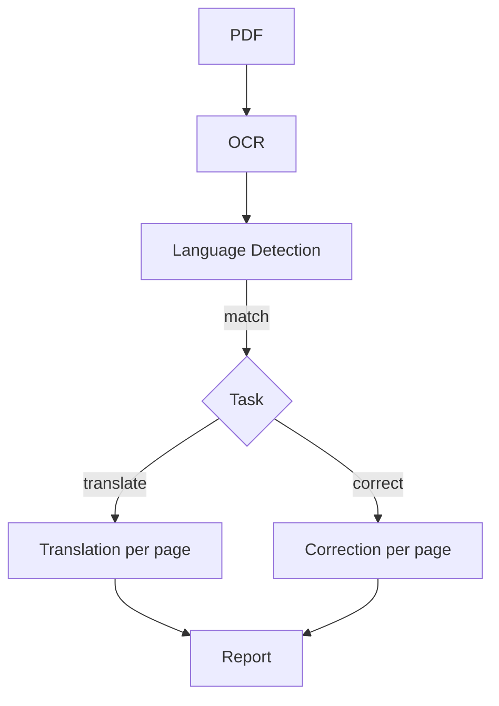
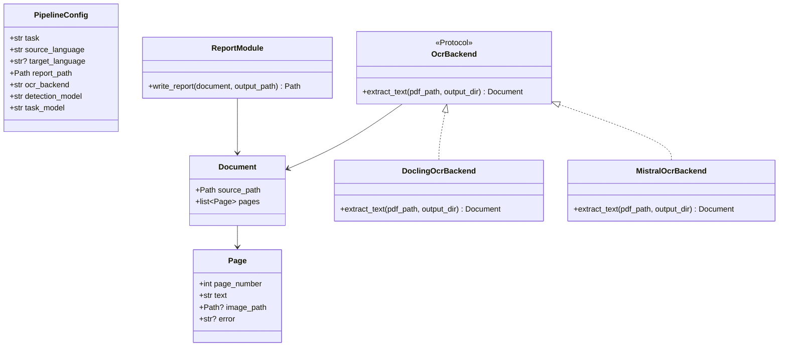

# TransFixDoc Architecture

TransFixDoc turns image-based PDFs into either translated text or a correction report. The pipeline is intentionally small:



## Package Choices

- `docling`: PDF OCR and page/document extraction.
- `pydantic`: shared data models and LLM JSON validation.
- `openai`: language detection, translation, and correction.
- `reportlab`: PDF report composition.
- `typer`: minimal CLI.

## Core Data Structures

Use Pydantic models so each stage has a typed input and output.

- `Page`: `page_number`, `text`, optional `image_path`, optional `error`. Used both for OCR output and for translation/correction output — context determines whether `text` is original or generated.
- `Document`: `source_path`, `pages: list[Page]`. The same shape is produced by OCR and returned by translation/correction; Stage 3 replaces each page's `text` with the generated output while preserving `image_path`.
- `PipelineConfig`: `task`, `source_language`, optional `target_language`, `report_path`, `ocr_backend`, `detection_model`, `task_model`.

`error` is populated only when per-page processing fails. The pipeline always finishes the report so the user can see the original images, then exits non-zero if any page errored.

Language detection returns a plain ISO language code string. Translation and correction both return a new `Document` with generated text per page.



## OCR Backends

Keep OCR swappable behind a small protocol:

```python
class OcrBackend(Protocol):
    def extract_text(self, pdf_path: Path, output_dir: Path) -> Document:
        """Extract page text and optional page images from a PDF."""
```

v1 ships one backend: `DoclingOcrBackend`. `MistralOcrBackend` is planned (see Future Work) and is shown in the class diagram to fix its shape early.

## Stage 1: OCR

`DoclingOcrBackend.extract_text(pdf_path, output_dir)` reads the PDF with Docling and returns a `Document`. It also exports one page image per PDF page into `output_dir` so the report can show the original page above the generated text.

Keep this stage independent from OpenAI so the backend can be swapped later. If OCR fails for the whole document, abort before any LLM calls are made.

## Stage 2: Language Detection

Build `detect_language(document: Document, model: str) -> str`.

Concatenate the first ~500 characters across pages as a representative sample, send it to OpenAI using `detection_model`, and return an ISO language code. Compare with `PipelineConfig.source_language`; raise a clear validation error and abort the pipeline when they don't match. v1 requires `--source-language`; auto-detect (using the detected code as the source) is future work.

## Stage 3: Translation Or Correction

Build:

- `translate_pages(document: Document, config: PipelineConfig) -> Document`
- `correct_pages(document: Document, config: PipelineConfig) -> Document`

Each function makes **one OpenAI call per page** using `task_model`. Per-page calls keep prompts small, localize failures, and let progress be reported as pages complete.

For translation, ask the model for the complete translated text of the page.

For correction, ask the model for clean corrected text only. Edit highlighting is done in post-processing by diffing the OCR text against the corrected text (e.g. `difflib` at the word level) and wrapping inserted/replaced spans in Markdown bold (`**...**`). This avoids relying on the model to honestly self-report its own edits.

Also, if no edits are made, just list that the page is correct.

If a page's LLM call raises, record the exception message on `Page.error` and leave `text` empty. Do not abort — continue with remaining pages so the report can still show the originals.

## Stage 4: Report Generation

Build `write_report(document: Document, output_path: Path) -> Path`.

Use `reportlab` to create a PDF. For each page, render the original page image (from `Page.image_path`), then either the generated text or — when `Page.error` is set — a clearly marked error block under the image so the failure is visible to the reader.

Render Markdown bold by converting `**x**` to `<b>x</b>` and feeding the result into reportlab's `Paragraph`, which natively supports a small HTML-like markup.

After writing the report, the CLI exits non-zero if any page in the `Document` has an `error`.

## CLI

Expose one command:

```bash
transfixdoc input.pdf --task correct --source-language de --report output/report.pdf
transfixdoc input.pdf --task translate --source-language de --target-language en --report output/report.pdf
```

`--report` maps to `PipelineConfig.report_path`. OCR intermediates (page images) are written to a `work/` directory next to the report; this can be overridden with `--workdir`.

The CLI should create `PipelineConfig`, run the four stages, write the final report, and propagate per-page failures as a non-zero exit.

## Code Layout

```text
src/transfixdoc/
  models.py      # Pydantic models
  ocr.py         # OcrBackend protocol + DoclingOcrBackend
  language.py    # language detection
  tasks.py       # translate/correct functions
  report.py      # PDF report writer
  cli.py         # Typer CLI
```

Each public function should use a short Google docstring with Args and Returns.

## Future Work

- Skip OCR for machine-readable PDFs.
- Add `MistralOcrBackend` as an alternate OCR backend.
- Auto-detect `source_language` when not provided.
- Rebuild the full PDF layout instead of generating a comparison report.
- Parallelize per-page LLM calls.
